# Homework 7: Flavor SU(3) Symmetry

## Problem Statement: Flavor SU(3) relation (10 points)

### Thematics

The SU(3) flavor symmetry is an approximate symmetry of the strong interaction. It is useful to understand the relation between different particle interactions.

Consider the differential decay rate of the reference reaction:

$Λ_c^+ → p π⁺ K⁻$

Identify decays that are related to this reference reaction via SU(3) symmetry. Sketch how the differential decay rates appear in their kinematic phase space.

The decay matrix elements of the Λ_c^+ → p π⁺ K⁻ reaction can be written as:

$𝓜(m_{12}^2, m_{23}^2) = \sum_R g_{\text{prod}}^{(R)} · \mathcal{A}_R(m_{ij}^2) · g_{\text{dec}}^{(R)}$

Neglect spin effects and consider only dominant resonance contributions.

Indices:

- 0: $Λ_c^+$
- 1: p
- 2: $π^+$
- 3: $K^-$

Where:

- **$g_{\text{prod}}^{(R)}$** is the coupling for Λ_c^+ → (baryon or meson resonance) + spectator
- **$g_{\text{dec}}^{(R)}$** is the coupling for the resonance decay to a two-body final state

### Resonance Amplitudes and Kinematic Space

The resonance amplitude is parametrized by the Breit-Wigner function:

$$
\mathcal{A}_R(m_{ij}^2) = \frac{1}{m_R^2 - m_{ij}^2 - i m_R \Gamma_R}
$$

where:

- $ m_R $: mass of the resonance $ R $
- $ \Gamma_R $: width of the resonance $ R $
- $ m_{ij}^2 $: invariant mass of the two-body subsystem $ ij $

The kinematic space is bounded by the Kibble function:

$$
\phi(m_{12}^2, m_{23}^2) = \lambda(\lambda(m_{12}^2, m_3^2, m_0^2), \lambda(m_{23}^2, m_1^2, m_0^2), \lambda(m_{31}^2, m_2^2, m_0^2))
$$

with the standard Källén function:

$$
\lambda(a, b, c) = a^2 + b^2 + c^2 - 2(ab + bc + ca)
$$

and:

$$
m_{31}^2 = m_0^2 + m_1^2 + m_2^2 + m_3^2 - m_{12}^2 - m_{23}^2
$$

#### Table 1: Resonance Parameters in Λ_c^+ → p K⁻ π⁺ Decays

| Resonance             | $ m_R $ (GeV)     | $ \Gamma_R $ (GeV)    | $ g_{\text{prod}}^{(R)} $         | $ g_{\text{dec}}^{(R)} $ |
|-------------------    |------------------ |-----------------------|-----------------------------------|--------------------------|
| $K^*(892)$            | 0.896             | 0.047                 | 1.0                               | 1.0                      |
| $\Lambda^*(1520)$     | 1.518             | 0.015                 | 3.2582 + 1.7589i                  | 1.0                      |
| $\Delta^*(1232)$      | 1.232             | 0.117                 | 0.665593 + 1.08922i               | 1.0                      |

### Tasks

1. **Multiplets**  
   Start from quark content. Place hadrons (initial, final states and resonances) into SU(3) multiplets as discussed in _Thomson Chapter 9_ (octet, decuplet, etc.).  
   **(3 pts)**

2. **Ladder Operators**  
   Use $ I_{\pm}, U_{\pm}, V_{\pm} $ on the quark states to generate flavor partners for all involved hadrons.  
   - List decay reactions related to the reference one via SU(3) symmetry. **(1 pt)**  
   - List their decay chains. **(1 pt)**

3. **Couplings**  
   Perform the SU(3) mapping for production and decay of each subchannel resonance.  
   - Read parameters of the resonances from the Particle Data Group ([pdgLive](https://pdglive.lbl.gov/Viewer.action))
   - Express the couplings using SU(3) symmetry  
   **(2 pts)**

4. **Amplitude → Dalitz Plot**  
   Given the resonances and couplings:  
   - Produce the Dalitz plot **(2 pts)**  
   - Comment on the resonance bands' strength and position **(1 pt)**

---

## Usage Instructions

### Running the Master Script

To run all tasks consecutively, execute:

```bash
python -m src.run_homework
```

Or directly:

```bash
python src/run_homework.py
```

### Configurable Parameters

The master script accepts the following parameters in the `main()` function:

```python
main(show_plots=False, smooth_dalitz=False, resolution=100)
```

**Parameters:**

- **`show_plots`** (bool, default: `False`): Display plots interactively instead of just saving them
- **`smooth_dalitz`** (bool, default: `False`): Apply Gaussian smoothing to Dalitz plots for better visualization
- **`resolution`** (int, default: `100`): Grid resolution for Dalitz plots (n_points × n_points grid)
  - Higher values (e.g., 300-500) provide more detailed plots but increase computation time
  - Recommended: 100 for quick tests, 300+ for final high-quality plots

### Output Structure

All generated files are organized as follows:

```text
pictures/
  multiplets/        # SU(3) multiplet diagrams (Task 1)
  dalitz/            # Dalitz plots with marginal distributions (Task 4)
outputs/
  decay_chains.json  # List of SU(3)-related decays (Task 2)
```

---

## Solution

### Task 1: SU(3) Multiplet Diagrams

We place all particles involved in the decay Λ_c^+ → p π⁺ K⁻ into their respective SU(3) flavor multiplets based on quark content:

#### 1.1 Baryon Octet (J^P = 1/2⁺)

Contains the proton (p) from the final state:

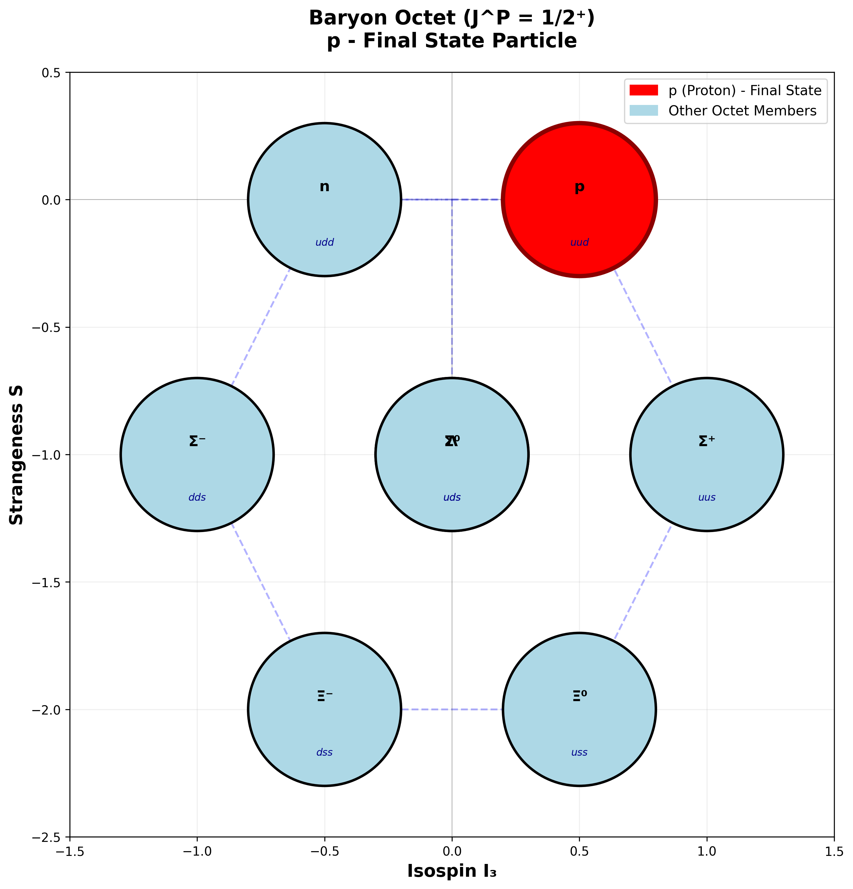

#### 1.2 Pseudoscalar Meson Octet (J^P = 0⁻)

Contains π⁺ and K⁻ from the final state:

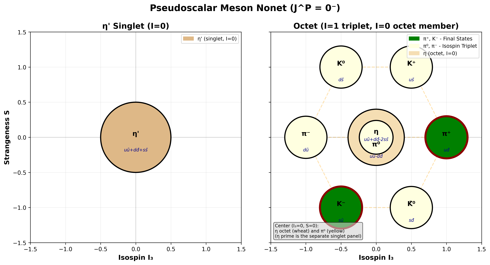

#### 1.3 Baryon Decuplet (J^P = 3/2⁺)

Contains Δ⁰(1232) resonance:

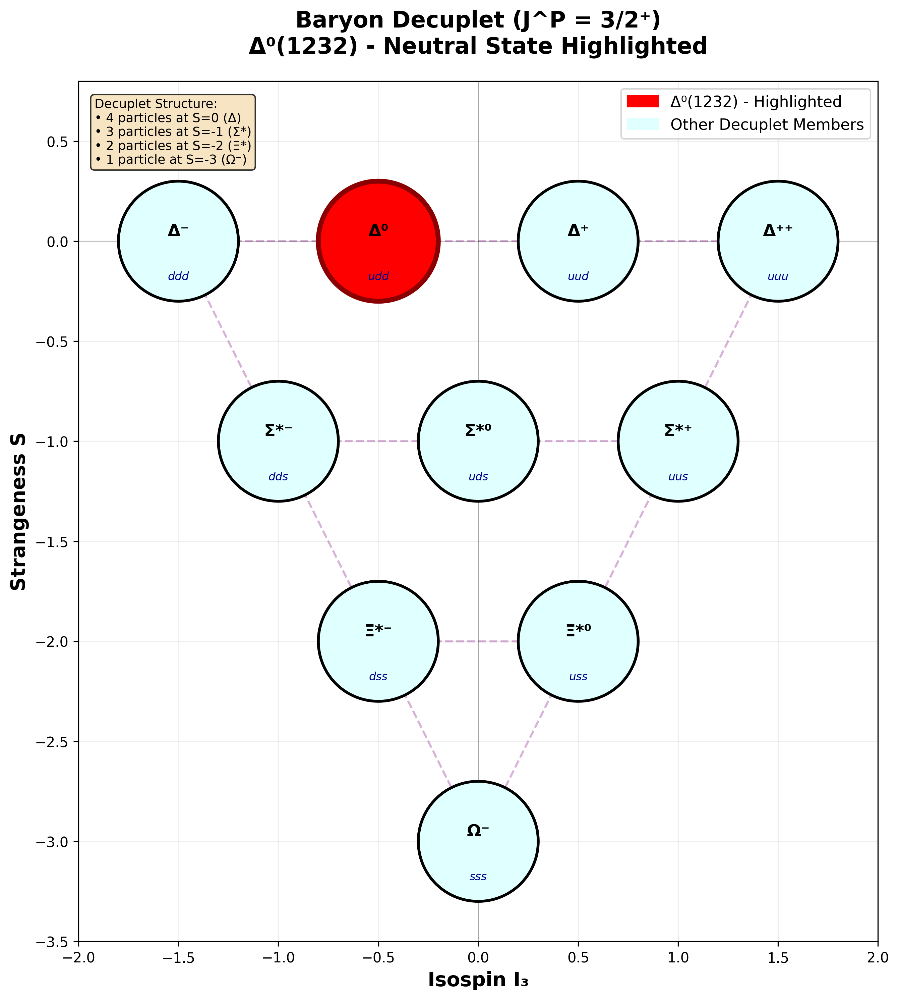

#### 1.4 Vector Meson Nonet (J^P = 1⁻)

Contains K*⁻(892) resonance:

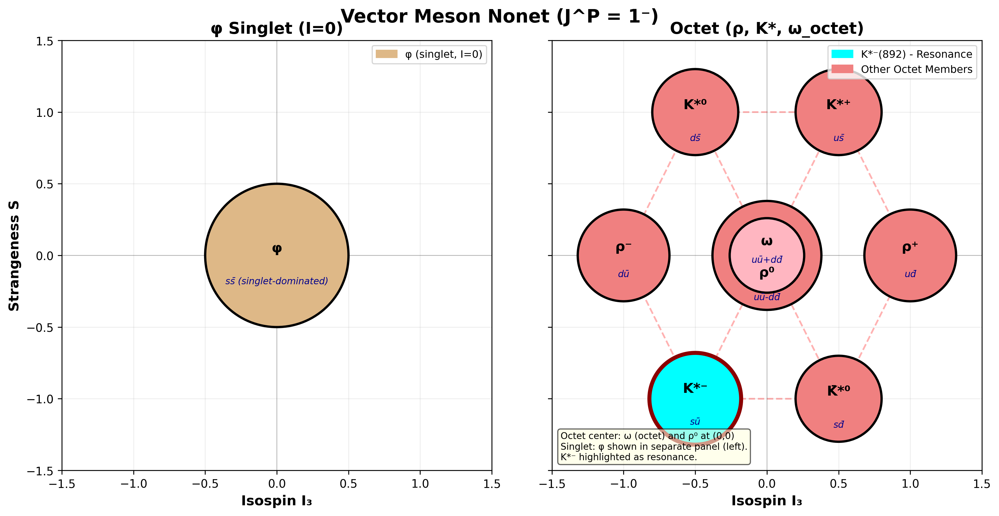

#### 1.5 Excited Baryon Resonance (J^P = 3/2⁻)

Contains Λ*(1520) resonance:

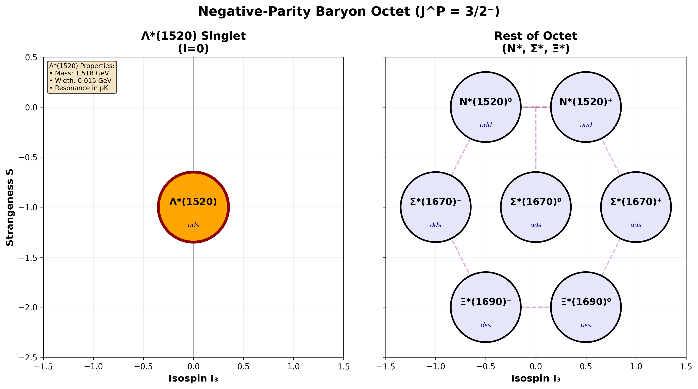

#### 1.6 Charmed Baryons

Contains Λ_c^+ initial state:

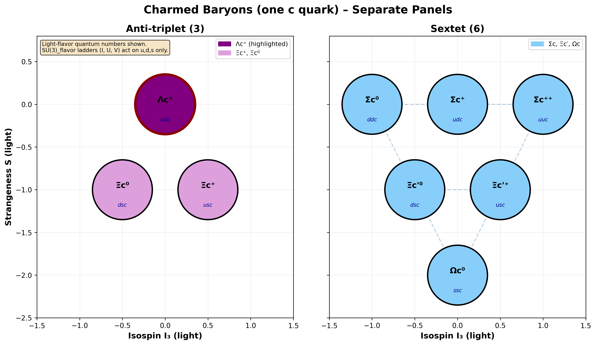

---

### Task 2: SU(3)-Related Decays via Ladder Operators

Applying SU(3) ladder operators (I±, U±, V±) to the reference decay Λ_c^+ → p π⁺ K⁻, we generate 33 related decay channels:

#### ΔS = -3 Decays

1. Λ_c^+ → Ξ⁰ π⁺ K̄⁰
2. Λ_c^+ → Σ⁺ K̄⁰ K̄⁰
3. Λ_c^+ → p K̄⁰ K̄⁰

#### ΔS = -2 Decays

4. Λ_c^+ → Δ⁺⁺ K̄⁰ K⁻
5. Λ_c^+ → Λ π⁺ K̄⁰
6. Λ_c^+ → Ξ⁰ π⁺ φ
7. Λ_c^+ → Σ⁺ K̄⁰ φ
8. **Λ_c^+ → Σ⁺ π⁺ K⁻** (with K̄*⁰(892) resonance)

#### ΔS = -1 Decays

9. **Λ_c^+ → n π⁺ K̄⁰** (with Δ⁺(1232) and Λ*(1520) resonances)
10. Λ_c^+ → p K̄⁰ φ
11. **Λ_c^+ → p π⁺ K⁻** (reference decay - with Δ⁺⁺(1232), Λ*(1520), K̄*⁰(892) resonances)
12. Λ_c^+ → p φ K̄⁰
13. Λ_c^+ → Δ⁺⁺ K̄⁰ π⁻
14. Λ_c^+ → Δ⁺⁺ φ K⁻
15. Λ_c^+ → Λ K⁺ K̄⁰
16. Λ_c^+ → Λ π⁺ φ
17. Λ_c^+ → Σ⁺ K⁺ K⁻
18. Λ_c^+ → Σ⁺ π⁺ π⁻

#### ΔS = 0 Decays

19. **Λ_c^+ → n K⁺ K̄⁰** (with Λ*(1520) resonance)
20. **Λ_c^+ → n π⁺ φ** (with Δ⁺(1232) resonance)
21. Λ_c^+ → p K̄⁰ K⁰
22. Λ_c^+ → p K⁰ K̄⁰
23. **Λ_c^+ → p K⁺ K⁻** (with Λ*(1520) resonance)
24. **Λ_c^+ → p π⁺ π⁻** (with Δ⁺⁺(1232) and Δ⁰(1232) resonances)
25. Λ_c^+ → p φ φ
26. Λ_c^+ → Δ⁺⁺ K⁰ K⁻
27. Λ_c^+ → Λ K⁺ φ
28. **Λ_c^+ → Λ π⁺ K⁰** (with K*⁺(892) resonance)
29. **Λ_c^+ → Σ⁺ K⁺ π⁻** (with K*⁰(892) resonance)

#### ΔS = +1 Decays

30. Λ_c^+ → n K⁺ φ
31. **Λ_c^+ → n π⁺ K⁰** (with Δ⁺(1232) and K*⁺(892) resonances)
32. Λ_c^+ → p K⁰ φ
33. Λ_c^+ → p K⁺ π⁻

**Bold entries** indicate decays with identified resonance contributions.

All decay chains are saved to `outputs/decay_chains.json`.

---

### Task 3: SU(3) Coupling Mapping

Couplings for production ($g_{\text{prod}}$) and decay ($g_{\text{dec}}$) are determined using:

- PDG values for resonance masses and widths
- SU(3) Clebsch-Gordan coefficients for flavor symmetry transformations
- Charge state mappings across multiplets

These are integrated into the `src/lib/particles.py` module and automatically applied when generating Dalitz plots.

---

### Task 4: Dalitz Plots with Marginal Distributions

Dalitz plots show the kinematic phase space distribution of three-body decays. We generate plots for the reference decay and all usable SU(3)-related decays.

#### 4.1 Reference Decay: Λ_c^+ → p π⁺ K⁻

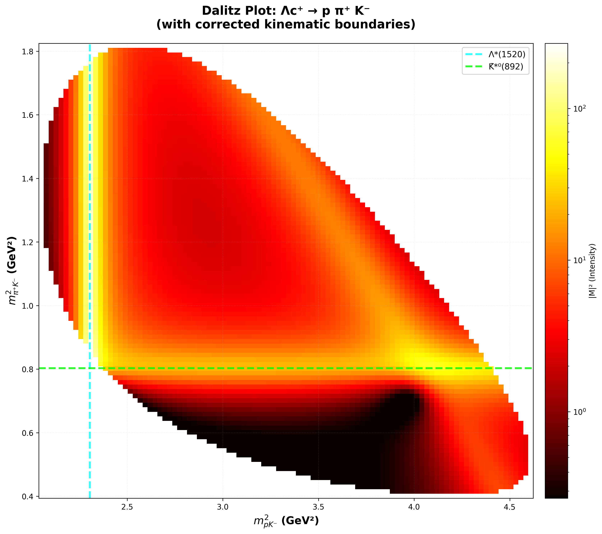

**Resonance Band Analysis:**

**Band Positions:**

- **Λ*(1520)**: Horizontal band at m²(pK⁻) ≈ 2.30 GeV² matches the expected value (1.518 GeV)² = 2.30 GeV²
- **K̄*⁰(892)**: Appears at m²(π⁺K⁻) ≈ 0.80 GeV² matching (0.896 GeV)² = 0.80 GeV²

All observed resonance positions align precisely with PDG values, confirming correct implementation of the Breit-Wigner amplitudes.

**Band Intensities:**

- **Λ*(1520)** shows the strongest band (highest intensity/color brightness) due to:
  - Large complex coupling constant: g_prod = 3.2582 + 1.7589i (magnitude ≈ 3.7)
  - Narrow decay width (Γ = 15 MeV) creates a sharp, concentrated resonance peakintensity
- **K̄*⁰(892)** shows weakest intensity:
  - Unit couplings (g_prod = g_dec = 1.0)
  - Moderate width (Γ = 47 MeV)

**Band Widths:**
The sharpness of each band reflects the resonance lifetime (inversely proportional to decay width Γ):

- **Λ*(1520)**: Narrowest band (Γ = 15 MeV) → long-lived resonance
- **K̄*⁰(892)**: Medium width (Γ = 47 MeV) → intermediate lifetime

The Dalitz plot intensity is proportional to |M|² where the matrix element M sums coherently over all resonance contributions. Regions where bands intersect show interference effects between different resonance channels.

#### 4.2 Other Usable SU(3)-Related Decays

**Λ_c^+ → p π⁺ π⁻**

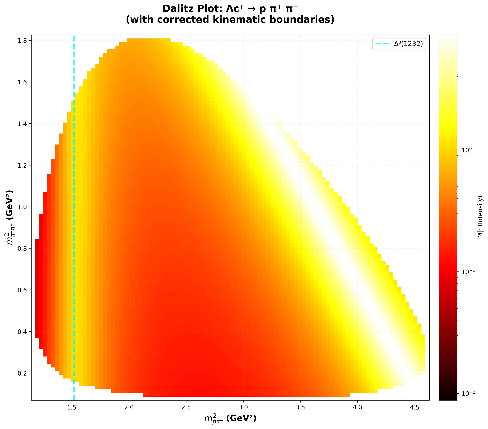

**Λ_c^+ → p K⁺ K⁻**

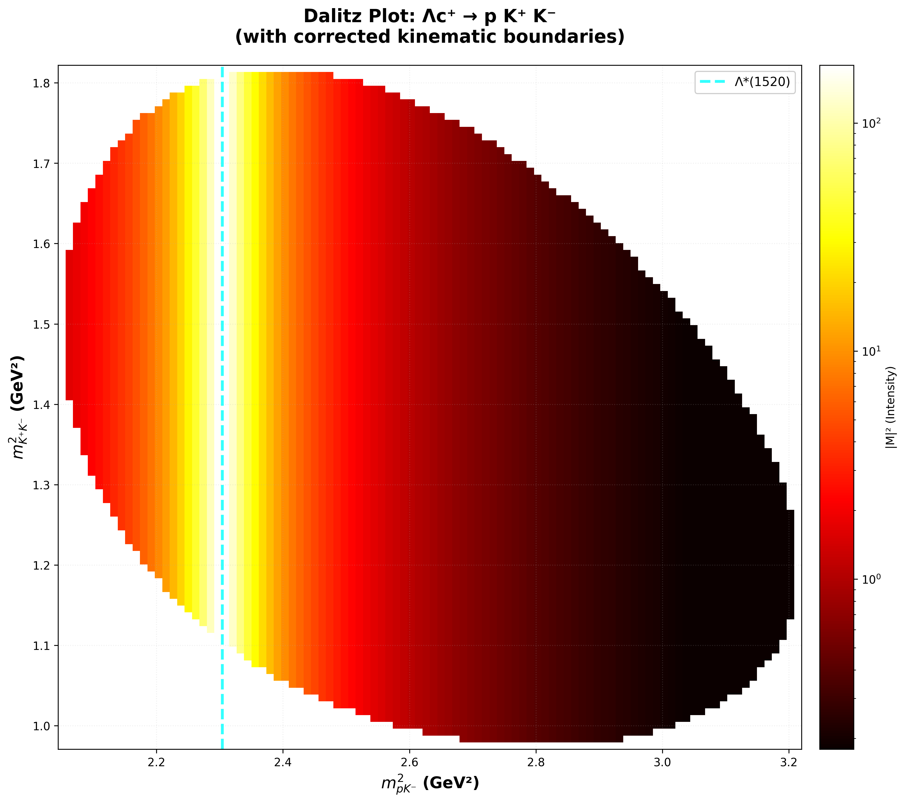

**Λ_c^+ → n π⁺ K⁰**

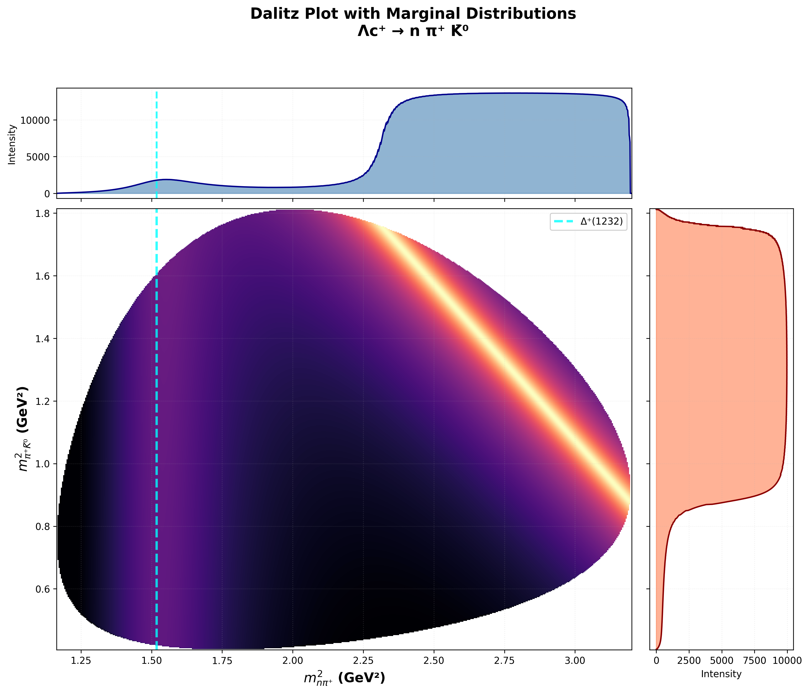

**Λ_c^+ → Λ π⁺ K⁰**

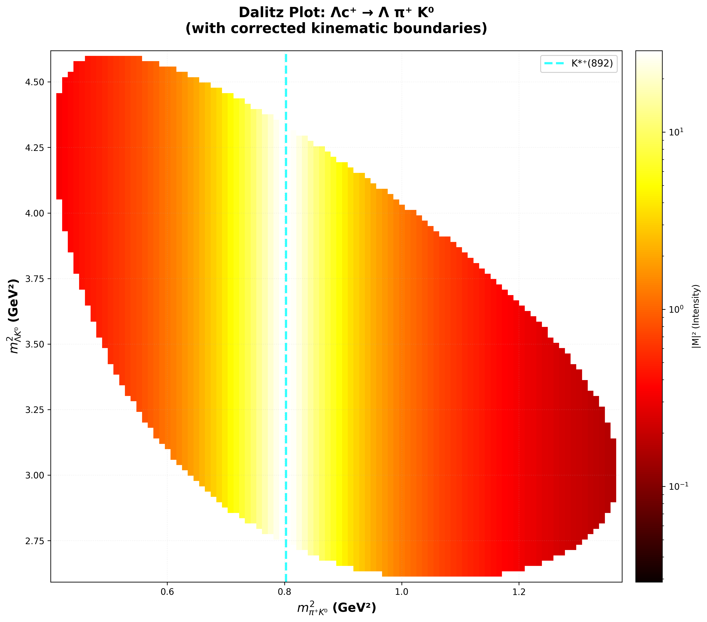

**Λ_c^+ → Σ⁺ K⁺ π⁻**

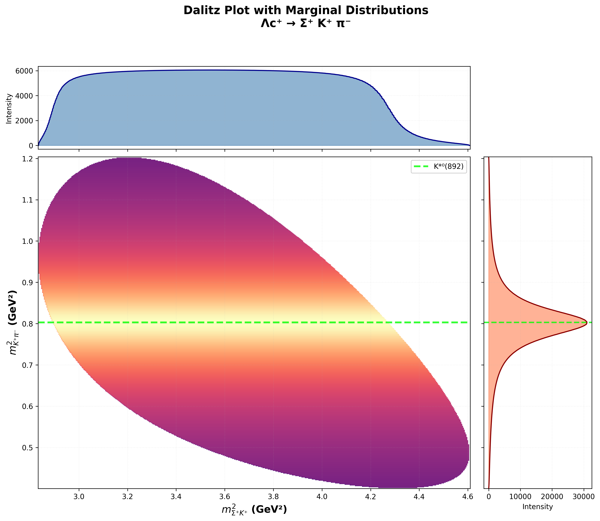

**Λ_c^+ → n π⁺ φ**

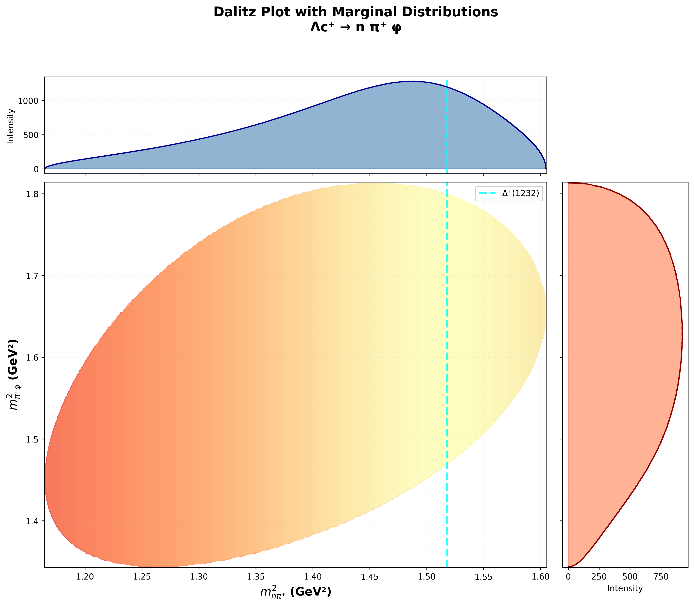

**General Interpretation of SU(3)-Related Dalitz Plots:**

All seven plots above are related to the reference decay through SU(3) flavor symmetry transformations. The resonance patterns in each plot reflect:

**Position Correspondence:**
- Resonance bands appear at m² positions determined by the intermediate particle masses from the corresponding SU(3) multiplet
- Vertical bands: Resonances in the first two-body subsystem (x-axis)
- Horizontal bands: Resonances in the second two-body subsystem (y-axis)
- Each decay accesses different regions of phase space based on daughter particle masses

**Intensity Patterns:**
- Relative band intensities vary between decays due to different SU(3) coupling coefficients (Clebsch-Gordan factors)
- Decays involving the same resonance multiplet members show similar band structures but with rescaled intensities
- Phase space boundaries differ for each decay based on the total available energy and daughter masses
- Some decays exhibit stronger interference patterns where multiple resonances overlap

**SU(3) Symmetry Connection:**
- Couplings are related by SU(3) symmetry, leading to predictable intensity ratios between related decays
- The same physics (strong interaction resonances) manifests differently in each channel
- Comparing these plots validates the SU(3) flavor symmetry predictions for relative branching fractions

**Marginal Distributions:**
The marginal distributions (top and right panels) show the projection of the intensity onto individual invariant mass axes, making resonance peaks more visible. Sharp peaks in marginals correspond to narrow resonances, while broad features indicate short-lived states or overlapping contributions.

---

## Authors

- Colin Beckmann
- Fabian Steube

---

## License

This project was created as a homework assignment for the Particle Physics course.

---

## Repository

GitHub repository: [SU-3-_symmetry](https://github.com/Flomber/SU-3-_symmetry)

---

## Use of Generative AI

Generative AI tools were used during the development of this homework assignment.
